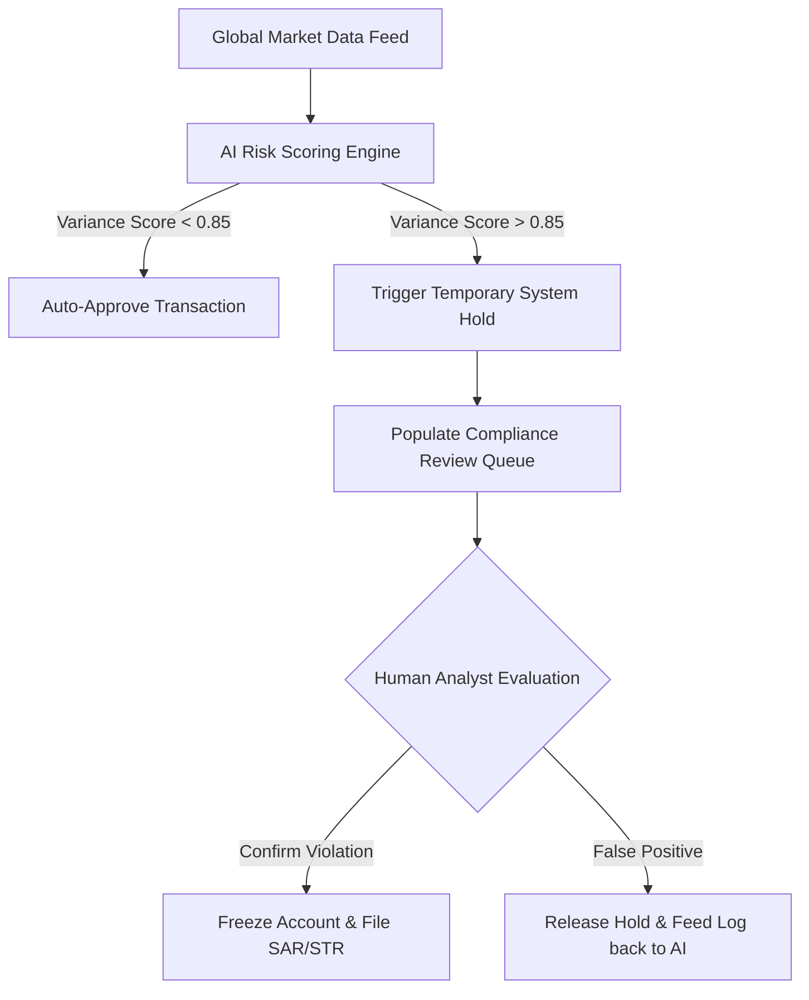

# AI Risk Mitigation & Human-in-the-Loop (HITL) Protocol

Hermes FG utilizes automated machine learning models to monitor transatlantic trading volumes, flag potential market manipulation, and cross-reference international sanctions lists. 

While automated systems process data at a scale humans cannot match, they lack context. They can misinterpret unique economic events or generate false positives that disrupt legitimate users. To maintain regulatory integrity and ensure fair trading conditions, Hermes FG enforces a strict **Human-in-the-Loop (HITL)** governance architecture.

---

## Why Hermes FG Enforces Human Oversight

Financial regulators—including the U.S. Commodity Futures Trading Commission (CFTC) and the European Securities and Markets Authority (ESMA)—require clear trails of accountability for automated financial decisions. 

Enforcing HITL protocol protects our ecosystem in three ways:

1. **Prevents Unwarranted Asset Freezes:** Automated flags protect the platform temporarily, but a human must confirm the legal basis before permanently restricting user funds.
2. **Eliminates Algorithmic Bias:** Machine learning models trained on historical data can inherit systemic gaps. Human compliance officers provide a necessary layer of contextual evaluation.
3. **Improves the Core AI Model:** Every time a human officer confirms a correct flag or overrides a false positive, that decision creates a clean data feedback loop that retrains and sharpens the AI model.

---

## The Core Operational Workflow

The boundary between machine automation and human authority is absolute. The AI system acts as a scout; human officers act as the final decision-makers.

## Automation Boundaries by Risk Category

To maximize platform efficiency without sacrificing legal compliance, automated actions are strictly bound by risk tiers:

### Low Risk: Automated Processing

* Examples: Standard address verification matches, routine trading volume checks.
* AI Authority: Fully automated. The system can approve accounts and clear trades instantly.

### Medium Risk: Conditional Automation with Human Audit

* Examples: Rapid transaction velocity spikes, cross-border retail transfers near $10,000 thresholds.
* AI Authority: The system can place a temporary 24-hour hold on the transaction, but a human analyst must review the audit log and manually release or permanent-freeze the funds.

### High Risk: Zero Automation Authority

* Examples: High-probability matches on international sanctions lists (OFAC/EU Sanctions Map), manual user disputes over a closed prediction market contract.
* AI Authority: Zero execution power. The system is legally prohibited from resolving these cases. It may only aggregate documentation and immediately route the file to a senior compliance officer for dual-signature manual resolution.

**Regulatory Standard Implementation:** This framework directly operationalizes the "Human Element" recommendations outlined in Federal Plain Language Guidelines and international financial data governance compacts.