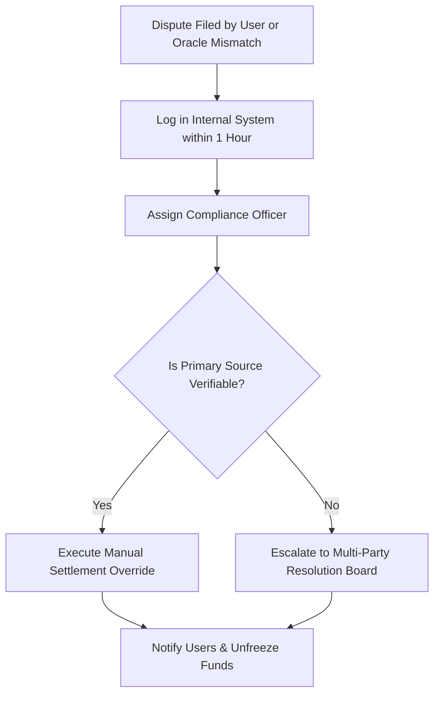

## Escalating and Resolving Event Market Disputes

In prediction markets, contract payouts are directly tied to real-world outcomes. When a user, an automated data oracle, or a public reporting source contests the formal resolution of an event contract (e.g., a disputed economic report release or a delayed legislative vote), the Market Operations team must freeze, investigate, and settle the contract manually.

This guide details the step-by-step internal compliance procedure for handling contested market settlements under CFTC and ESMA market integrity rules.

---

### Dispute Escalation Path

The flowchart below outlines the life cycle of an escalated event contract dispute from initial flag to final human-authorized payout release:

