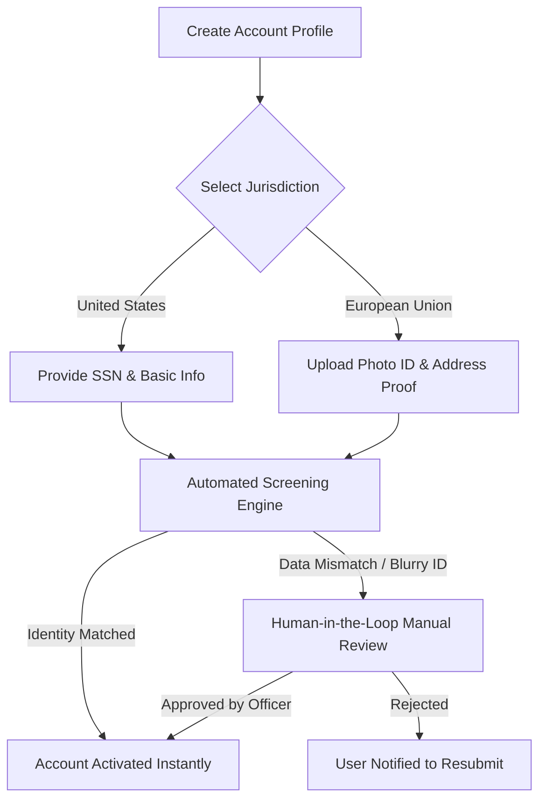

# User Account Onboarding & Identity Verification

Welcome to Hermes FG. Because our platform allows you to trade both standard retail assets and regulated event contracts across the United States and Europe, international financial laws require us to verify your identity. 

This verification process is called **Know Your Customer (KYC)**. It prevents identity theft, financial fraud, and money laundering. 

This tutorial walks you through setting up and verifying your account securely.

## What You Will Need Before You Start

Depending on where you live, make sure you have the following information or documents ready:

*   **United States Residents:** Your full legal name, date of birth, residential address, and your **Social Security Number (SSN)**.
*   **European Union Residents:** A valid government-issued photo ID (Passport or National ID Card) and a digital **Proof of Address** document (such as a utility bill or bank statement issued within the last 3 months).

## Onboarding Workflow

The diagram below shows how your identity information moves through our secure verification pipeline:

## Step-by-Step Onboarding Steps

### Step 1: Create Your Profile and Choose Jurisdiction

1. Navigate to the Hermes FG web application or open the mobile app.
2. Click **Sign Up **and enter a secure email address and password.
3. On the **Trading Jurisdiction** screen, select your country of permanent residence.

> **Note:**  This choice is critical. Your jurisdiction determines whether your account is regulated under the US Commodity Futures Trading Commission (CFTC) or the European Securities and Markets Authority (ESMA).

### Step 2: Input or Upload Your Identity Credentials

Follow the track that matches your selected jurisdiction:

* **Track A: United States Residents**

1. Enter your Legal First and Last Name exactly as they appear on your tax documents.
2. Input your Date of Birth and current residential address (P.O. Boxes are legally prohibited).
3. Enter your **9-digit Social Security Number (SSN)**. *Your data is fully encrypted and never stored as plaintext.*

* **Track B: European Union Residents**

1. Confirm your country of citizenship.
2. Upload a clear, glare-free photograph of your **Passport** or **National ID card**. Ensure all four corners of the document are visible in the image frame.
3. Upload a PDF copy of your **Proof of Address**. The document name must match the name on your photo ID exactly.

### Step 3: Await Verification Results

Once you click **Submit**, our automated verification systems cross-reference your data with secure global identity networks.

1. **Instant Approval:** If your data matches securely, your dashboard will unlock within 2 minutes.
2. **Conditional Hold**: If a document is blurry or an address cannot be matched automatically, your application enters our **Human-in-the-Loop queue**. A compliance officer will manually review the mismatch within 2 hours. Do not attempt to submit a second application while this review is pending.

> **Data Privacy Guarantee:** All onboarding data is handled in strict compliance with the Gramm-Leach-Bliley Act (GLBA) in the United States and the General Data Protection Regulation (GDPR) within the European Union. Your identity documents are encrypted both in transit and at rest.